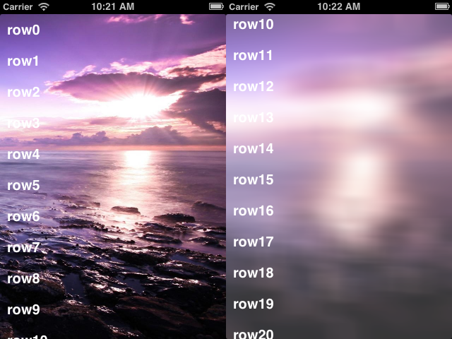

## TiDKLiveBlur

Wrapping [DKLiveBlur](https://github.com/kronik/DKLiveBlur) for Ti.UI.TableView and Ti.UI.ListView on Titanium Mobile.



## Feature
* Frosted glass effect in TiUITableView and TiUIListView

## Install
[Compiled module download](be.k0suke.tidkliveblur-iphone-0.1.zip)

```
$ git clone git@github.com:k0sukey/TiDKLiveBlur.git
$ cd TiDKLiveBlur
$ git submodule init
$ git submodule update
$ ./build.py
```

## Usage
### Classic style(for Ti.UI.TableView)
```
var tableView = Ti.UI.createTableView({
	backgroundBlurImage: '/background.png',
	glassColor: '#fff', // optional, default #fff
	data: [
		{ title: 'row0' },
		{ title: 'row1' },
		{ title: 'row2' },
		{ title: 'row3' },
		{ title: 'row4' },
		{ title: 'row5' },
		{ title: 'row6' },
		{ title: 'row7' },
		{ title: 'row8' },
		{ title: 'row9' }
	]
});
```

### Alloy(for Ti.UI.ListView)
#### View
```
<Window>
	<ListView id="lists" defaultItemTemplate="list">
		<Templates>
			<ItemTemplate name="list">
				<Label bindId="name" class="name"/>
			</ItemTemplate>
		</Templates>

		<ListSection id="section" dataCollection="lists" dataTransform="doTransform">
			<ListItem template="list" name:text="{name}"/>
		</ListSection>
	</ListView>
</Window>
```

#### XML
```
'#lists': {
	backgroundBlurImage: '/background.png',
	glassColor: '#fff'
}
```

### Properties
#### backgroundBlurImage
Background image for TiDKLiveBlur.
Not backgroundImage propertie.

#### glassColor
Frosted flass effect color.

### Methods
#### getBackgroundBlurImage / setBackgroundBlurImage
getter / setter for backgroundBlurImage.

#### getGlassColor / setGlassColor
getter / setter for glassColor.

## License

The MIT License (MIT) Copyright (c) 2013 Kosuke Isobe, Socketbase Inc.

Permission is hereby granted, free of charge, to any person obtaining a copy of this software and associated documentation files (the "Software"), to deal in the Software without restriction, including without limitation the rights to use, copy, modify, merge, publish, distribute, sublicense, and/or sell copies of the Software, and to permit persons to whom the Software is furnished to do so, subject to the following conditions:

The above copyright notice and this permission notice shall be included in all copies or substantial portions of the Software.

THE SOFTWARE IS PROVIDED "AS IS", WITHOUT WARRANTY OF ANY KIND, EXPRESS OR IMPLIED, INCLUDING BUT NOT LIMITED TO THE WARRANTIES OF MERCHANTABILITY, FITNESS FOR A PARTICULAR PURPOSE AND NONINFRINGEMENT. IN NO EVENT SHALL THE AUTHORS OR COPYRIGHT HOLDERS BE LIABLE FOR ANY CLAIM, DAMAGES OR OTHER LIABILITY, WHETHER IN AN ACTION OF CONTRACT, TORT OR OTHERWISE, ARISING FROM, OUT OF OR IN CONNECTION WITH THE SOFTWARE OR THE USE OR OTHER DEALINGS IN THE SOFTWARE.
